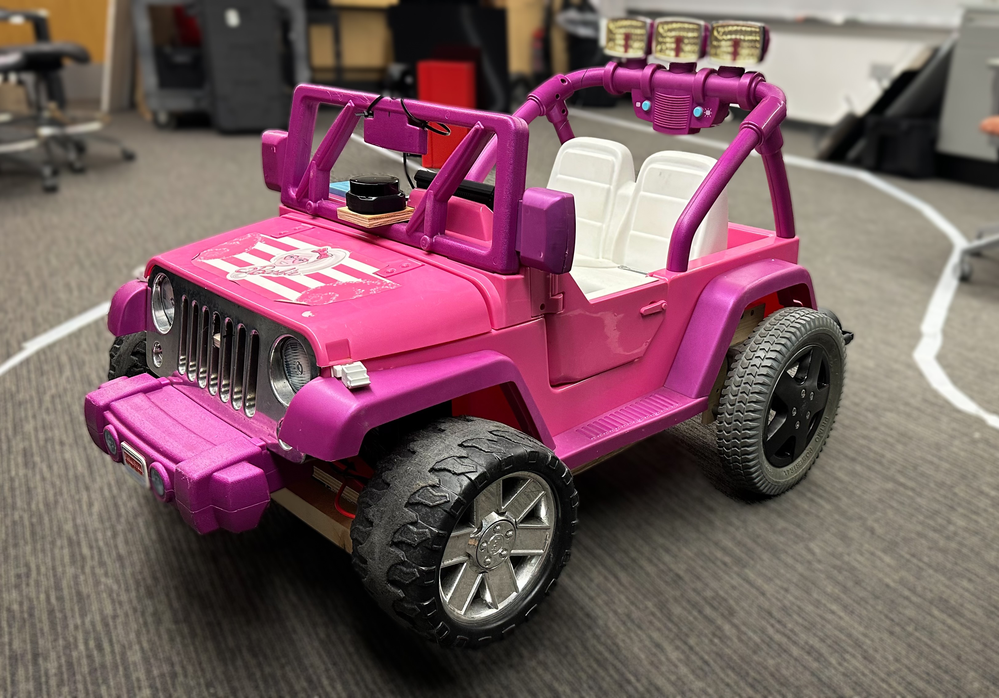

# IGVC-Robot-Barbie-Jeep
This project focuses on developing an autonomous vehicle for the Intelligent Ground Vehicle Competition (IGVC). The vehicle integrates lane-keeping and object-avoidance algorithms, coupled with precise motor control, to navigate complex environments.

### Features:
- **Lane Detection**: Real-time lane detection algorithms for staying within designated paths, even when only one lane is visible using a 120 degree wide-angle camera.
- **Object Avoidance**: LiDAR-based object detection and avoidance, combined with custom algorithms for navigating around obstacles.
- **Motor Control**: Efficient communication between a NVIDIA Jetson Nano and Arduino ESP32 to control motors via a Sabretooth motor driver.
- **Hybrid Approach**: Combines Python-based software for computer vision processing on the Jetson Nano with motor control logic executed on the TM4C MCU.
